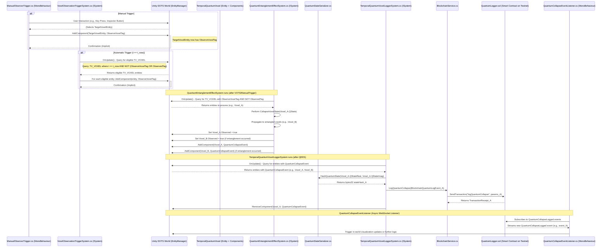

# QUANTUM_COLLAPSE_FLOW.md

This document describes the canonical lifecycle of the Quantum Collapse Event within the Rahinii.VoxelNet architecture.

## Mermaid.js Sequence Diagram

## Additional Notes

- This file is stored under `docs/QUANTUM_COLLAPSE_FLOW.md`
- Include both Mermaid.js and PlantUML versions for flexibility in rendering environments
